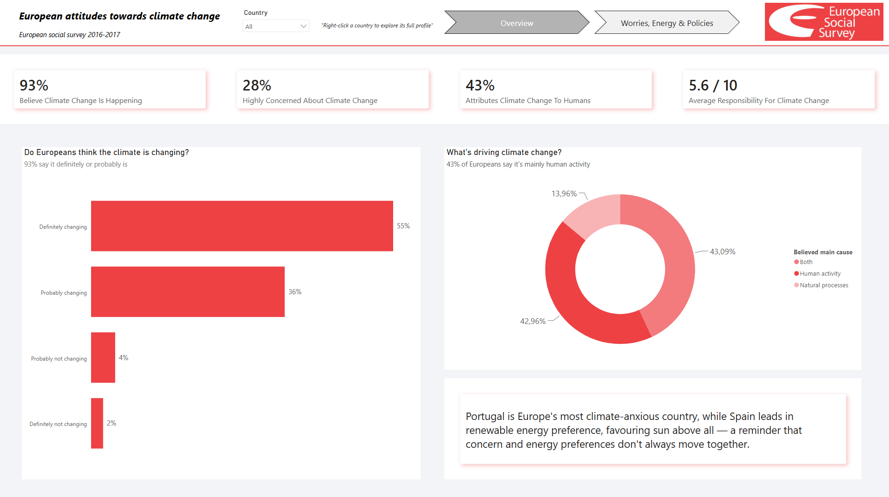
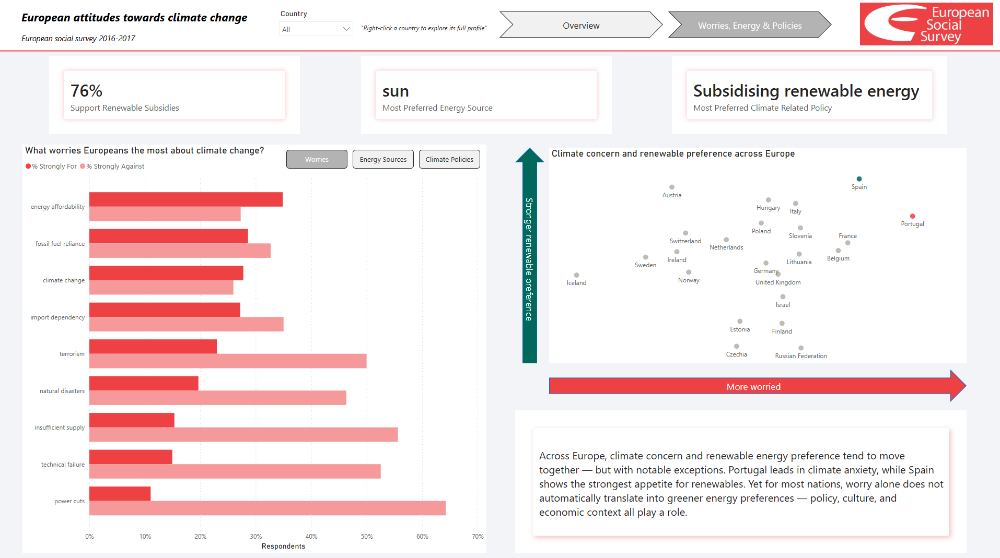
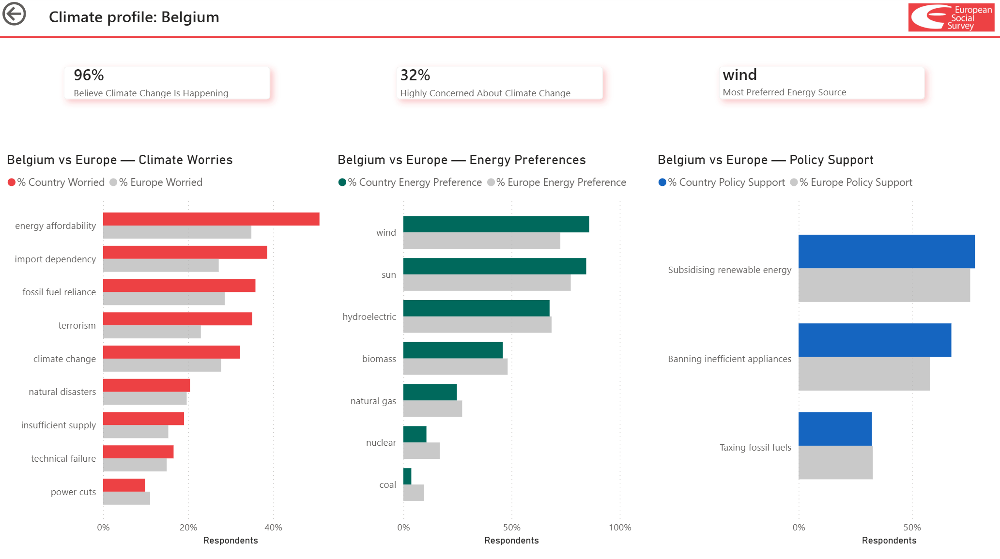

# European Attitudes Toward Climate Change — Power BI Project

**Boolean Master in Data Analytics — Project Assignment**

A Power BI dashboard exploring how European citizens perceive and respond to climate change, built on European Social Survey (ESS) data.

---

## 1. Business Problem

Created on behalf of (simulated) the European Institute for Social Policy (EISP), as part of an article on climate change. The goal is to create a dashboard that allows users to explore European citizens’ attitudes toward climate change during the 2016–2017 period, balancing two needs: giving users the freedom to explore the available data while clearly communicating the key insights that emerged from the analysis.

The dashboard does not necessarily cover all the variables available in the dataset, but focuses on four key areas identified by the EISP:

- What was the general opinion of Europeans regarding climate change?
- How concerned were Europeans about climate change?
- What were their preferences regarding different energy sources?
- How did these opinions vary across different European countries?


## 2. Data Sources

| Source | Content | Access method |
|---|---|---|
| [European Social Survey (ESS)](https://www.europeansocialsurvey.org/) | 2016/17 Survey (Round 8) - Variables Group Climate change | Direct Download |

## 3. Power BI Dashboard

Key features of the dashboard:

- **Bookmark-driven navigation**: Transitions between views and filter states managed via bookmarks, providing guided navigation rather than leaving the user to find their way among scattered filters.
- **Hidden drillthrough page**: A detail page accessible only via drill-through (not visible in the main navigation), allowing users to explore a specific country in comparison with the rest of Europe without cluttering the main view.
- **Semantically Consistent Color Palette**: A color scheme chosen to reflect the meaning of the data (e.g., a gradient from “cool” to “warm” colors for increasing levels of perceived concern/risk), not arbitrary.


> **Screenshots**
>
> 
> 
> 

## 4. Key Findings

- Portugal is Europe's most climate-anxious country, while
Spain leads in renewable energy preference, favouring Sun above all — a reminder that concern and energy preferences don't always move together.
- Across Europe, climate concern and renewable energy preference tend to move together but with notable exceptions. Portugal leads in climate anxiety, while Spain shows the strongest appetite for renewables. Yet for most nations, worry alone does not automatically translate into greener energy preferences — policy, culture, and economic context all play a role.

## 5. Repository Structure

```
├── data/                       # dataset ESS raw and clean
├── screenshots/                # Power BI dashboard screenshots
├── dashboard.pbix              # dashboard Power BI (requires Power BI Desktop)
└── README.md
```

## 6. Tech Stack

- **Power BI Desktop**: bookmark, drillthrough, DAX measures, page navigator, dynamic text insights

## 7. Author

Ismael Pumpo - [LinkedIn](https://www.linkedin.com/in/ismael-pumpo-362297212) — [GitHub](https://github.com/Ismael-PmP) · Boolean Master in Data Analytics, 2026
