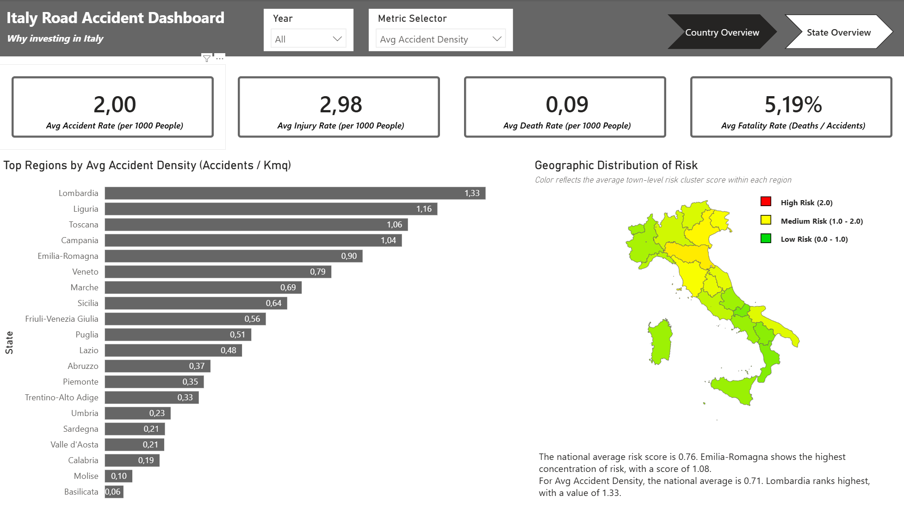
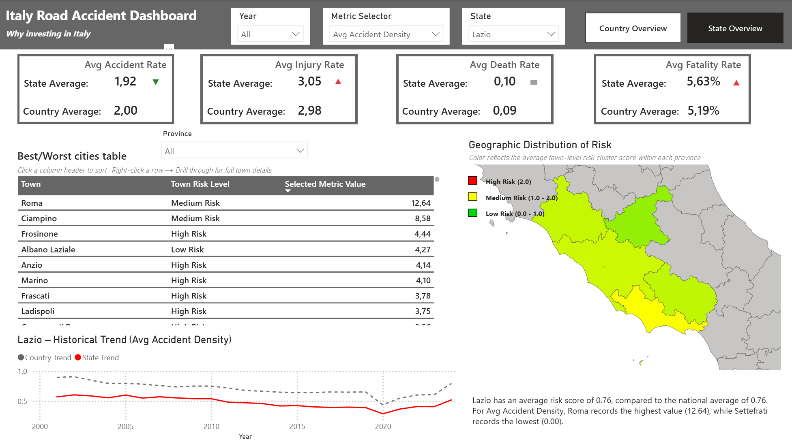
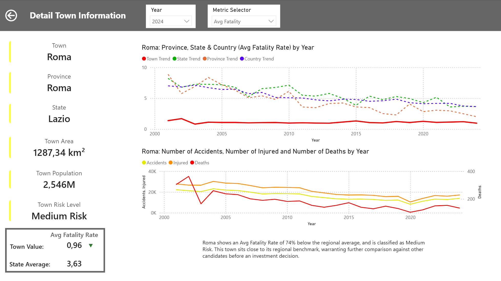

# Italy Road Accident Risk Analysis — Capstone Project

**Boolean Master in Data Analytics — Final Project**

A data pipeline and Power BI dashboard identifying the Italian towns with the highest road accident risk, built to support investment decisions for a fictional risk-prevention and traffic-management company.

---

## 1. Business Problem

The company needs to identify which Italian municipalities carry the highest road accident risk, using historical data (2001–2024) rather than raw, unreliable, and scattered public sources. The dashboard needs to answer, at national, regional, and town level:

- Which towns have the highest accident rates, injury rates, death rates, and fatality rates?
- How does a given town compare to its region and to the national average?
- Which places represent the strongest candidates for risk-mitigation investment, and which are comparatively safer?

## 2. Data Sources

| Source | Content | Access method |
|---|---|---|
| [ISTAT SDMX API](https://esploradati.istat.it/SDMXWS/rest/data/41_983) | Yearly accidents, injuries, and deaths per municipality (2001–2024) | REST API (CSV via `Accept: application/vnd.sdmx.data+csv`) |
| [SITUAS](https://situas.istat.it) | Resident population and surface area per town, year-specific | REST API (POST requests, 24 yearly extractions) |

Both sources are fetched programmatically in the notebook rather than downloaded manually, so the pipeline can be re-run as ISTAT publishes new data.

## 3. Methodology

### 3.1 Data Cleaning
- **Stable-town filtering**: the number of towns varies slightly year to year due to mergers/splits of very small towns. Only towns present in *all* 24 SITUAS extractions were kept, since these represent a negligible share of population and are not realistic investment targets anyway.
- **Targeted imputation**: ~2,000 missing values in the province license-plate code were traced to a single region (Campania) and filled using the correct automotive abbreviation instead of being dropped.
- **ISTAT reshape**: the raw SDMX export is long-format (one row per observation type); it was pivoted so each row represents one town-year with accidents, injuries, and deaths as separate columns, enabling a clean join with SITUAS.
- **Division-by-zero handling**: towns with zero recorded accidents in a given year cannot have a meaningful fatality rate. These were set to `NaN` rather than 0, to distinguish *"no data"* from *"zero risk"* — a distinction that later required explicit handling in Power BI as well (see §4).

### 3.2 Exploratory Data Analysis
- **Univariate**: accident/injury/death counts and most rate variables are heavily right-skewed — a structural feature of Italy's territory (thousands of small towns, few large cities), not a data quality issue. Verified against public sources before excluding any value as an outlier. Log scales were used throughout to make the distributions readable.
- **Bivariate**: Pearson and Spearman correlations were compared side by side, since several relationships (e.g. `Fatality_Rate` vs `Death_Rate_1000_Pop`) are monotonic but not linear — a case where Pearson alone would have understated the relationship.

### 3.3 Clustering (Risk Segmentation)
- **Features**: accident rate, death rate, injury rate, and fatality rate per 1,000 inhabitants — chosen because a risk-prevention company cares about severity, not only frequency.
- **Preprocessing**: log transformation (to correct skew) followed by standardization (equal weight across variables of different scales), with missing rate values imputed to 0 for clustering purposes only — a deliberate departure from the "keep as NaN" choice made during EDA, justified by the fact that a town with zero recorded incidents is a legitimate low-risk observation for classification, not a data gap.
- **Algorithm**: K-Means, k = 3 selected via the elbow method.
- **Cluster interpretation**: clusters were labeled by inspecting mean feature values, not assumed from cluster index. Notably, the "High Risk" cluster is *not* the one with the most accidents — it is distinguished by disproportionately higher death/fatality rates, i.e. severity rather than frequency.

## 4. Power BI Dashboard

Three pages, each filterable by **Year** and by a **Field Parameter** metric selector (Accident Rate, Death Rate, Injury Rate, Fatality Rate, Accident Density):

1. **Country Overview** — country KPIs, a risk gradient map of the 20 regions, a ranking of states by the selected metric, and a dynamic text summary.
2. **State Overview** — state-level KPIs benchmarked against the country average (with directional indicators), a province-level risk map, and a sortable town ranking table with drillthrough to page 3.
3. **Town Detail** (drillthrough) — town profile (population, area, risk class), the selected metric benchmarked against town/province/state/country trends on a single time series, and a narrative investment verdict.

Methodological choices made in the Power BI dashboard:

- **Weighted vs. simple average**: country/state KPIs for rate metrics (e.g. fatality rate) are computed as `SUM(numerator) / SUM(denominator)`, not as an average of per-town rates — averaging already-normalized rates would let small towns with extreme, low-sample-size ratios distort the aggregate.
- **BLANK-aware rankings**: "best/worst town" calculations explicitly filter out towns with no valid observation for the selected metric/year before ranking, since DAX treats `BLANK` as the lowest possible value — left unhandled, this silently returns towns with *no data* instead of towns with the *lowest risk*.
- **Geographical distribution of risk**: state-level risk aggregation understates hotspots when using the mode of town-level risk classes, since low/medium-risk towns always outnumber high-risk ones; the dashboard uses the average risk score calculated at the town-level rather than the mode, to preserve visibility of state-level and province/level risk gradients.

> **Screenshots**
>
> 
>
> 
>
> 

## 5. Key Findings

- Road risk in Italy does not concentrate where accident *volume* is highest (large cities), but where *severity* is disproportionate relative to accident frequency — a distinction only visible after separating rate-based clustering from raw counts.
- With regard to this observation, it should be noted that the southern regions, despite having a lower overall risk level (taking into account both the frequency and severity of accidents) and fewer accidents than the northern regions, have a higher average fatality rate (number of deaths / number of accidents) than the other regions. This suggests that accidents in the south are, on average, more severe, or that the emergency response infrastructure is not adequately prepared.
- As can be seen from the line charts, for all the selected metrics and across all regions (some more than others), there was a decline during the 2020–2021 period due to reduced traffic caused by the COVID-19 pandemic.
- It can be seen that all statistics related to traffic accidents have been declining since 2001 (in larger towns, this trend is more noticeable due to the high number of accidents). This suggests that the awareness campaigns, public information efforts, and stricter penalties implemented over the years have had the desired effect, making Italy a safer country in terms of road safety.

## 6. Repository Structure

```
├── data/                                # raw and clean data (SITUAS + ISTAT extractions, merged dataset)
├── screenshots/                         # screenshots of power BI dashboard
├── main_notebook.ipynb                  # full pipeline: extraction, cleaning, EDA, clustering
├── dashboard.pbix                     # Power BI dashboard (requires Power BI Desktop to open)
├── Capstone_Project.md.docx                 # original assignment brief
├── Italy Road Accident Risk Analysis.pptx   # powerpoint presentation
└── README.md
```

## 7. Tech Stack

- **Python**: pandas, numpy, requests, matplotlib, seaborn, scikit-learn (`KMeans`, `StandardScaler`)
- **Power BI Desktop**: Shape Maps, Field Parameters, DAX measures, drillthrough, bookmarks and page navigator

## 8. Author

Ismael Pumpo - [LinkedIn](https://www.linkedin.com/in/ismael-pumpo-362297212) — [GitHub](https://github.com/Aaronstriker) · Boolean Master in Data Analytics, 2026
